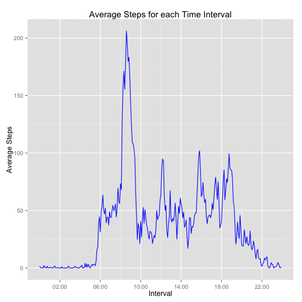
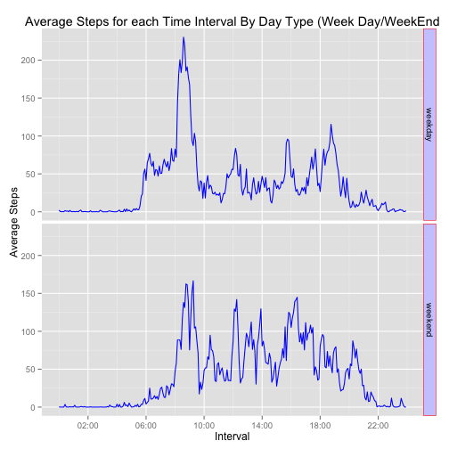

## Loading and preprocessing the data


```r
# In this step we will unzip the activity.zip and load activity.csv file 
unzip ("activity.zip", overwrite = TRUE);
activity_info <-read.csv("activity.csv")
summary(activity_info)
```

```
##      steps                date          interval     
##  Min.   :  0.00   2012-10-01:  288   Min.   :   0.0  
##  1st Qu.:  0.00   2012-10-02:  288   1st Qu.: 588.8  
##  Median :  0.00   2012-10-03:  288   Median :1177.5  
##  Mean   : 37.38   2012-10-04:  288   Mean   :1177.5  
##  3rd Qu.: 12.00   2012-10-05:  288   3rd Qu.:1766.2  
##  Max.   :806.00   2012-10-06:  288   Max.   :2355.0  
##  NA's   :2304     (Other)   :15840
```


## What is mean total number of steps taken per day?

```r
library(dplyr)

## use only those observations that have none na values for the step out
activity_info_without_na <- activity_info[!is.na(activity_info$steps),]

day_groups <- group_by(activity_info_without_na, date)
summary_by_day <- summarize(day_groups, num.types=n(), TotalSteps=sum(steps))

summary_by_day_df <- data.frame(summary_by_day)
# histogram of total steps
hist(summary_by_day_df$TotalSteps, xlab="Total Steps", main = "Histogram of Total Steps")
```

 

```r
 mean_summary_by_day <- mean(summary_by_day_df$TotalSteps)

 median_summary_by_day <- median(summary_by_day_df$TotalSteps)
```

1. Mean Steps taken by day: 1.0766189 &times; 10<sup>4</sup>
2. Median Steps taken by day: 10765


## What is the average daily activity pattern?


```r
## Summarize the average data for each interval
interval_groups <- group_by(activity_info_without_na, interval)
summary_by_interval <- summarize(interval_groups, AverageSteps=mean(steps))

# create date_time value using strptime
summary_by_interval$date_time <- strptime(sprintf("%04d",summary_by_interval$interval), "%H%M")
summary_by_interval_df <- data.frame(summary_by_interval)


## Plot using ggplot2
library(ggplot2)
library(scales)

ggplot(data=summary_by_interval_df, aes(x=date_time, y=AverageSteps))+geom_line(color="blue") + xlab("Interval") + ylab("Average Steps") + ggtitle("Average Steps for each Time Interval")  + scale_x_datetime(labels = date_format("%H:%M"),breaks = "4 hour")
```

 

```r
## pick the interval that has the max steps:
max_steps_interval <- summary_by_interval_df[summary_by_interval_df$AverageSteps == max(summary_by_interval_df$AverageSteps),1] 
```

1. Interval that has Max Steps is 835


## Imputing missing values


```r
### reporting missing values

## count of rows with na values in the original dataset
na_row_count <- nrow(activity_info[is.na(activity_info$steps),])
```
### Strategy to fix NA Values:
 * We will use the average steps for the interval across all days to fill the NA values
 * To fix an interval 110 that has an NA value we will use the average value for this interval that has been calculated in Question 3
 * merge activity_info ( which is original data with na) to summary_by_interval_df which has the average value for each interval.


```r
merged_data <- merge(activity_info,summary_by_interval_df, by="interval")

## create a new column ImputtedSteps that will have the average steps if actual steps is na
merged_data <- mutate(merged_data, ImputtedSteps = ifelse( is.na(steps) , AverageSteps ,steps))


activity_info_clean <- merged_data[,c(6,3,1)]

### match the column names to the original column names
colnames(activity_info_clean) <- colnames(activity_info)


day_groups_imputted <- group_by(activity_info_clean, date)
summary_by_day_imputted <- summarize(day_groups_imputted, num.types=n(), TotalSteps=sum(steps))

summary_by_day_imputted_df <- data.frame(summary_by_day_imputted) 
```


```r
# histogram of total steps of Imputted Dataset and mean and median


hist(summary_by_day_imputted_df$TotalSteps , xlab="Total Steps", main = "Histogram of Total Steps from Imputted Dataset")
```

 

```r
## mean and median of imputted data
mean_imput <- mean(summary_by_day_imputted$TotalSteps)

median_imput <- median(summary_by_day_imputted$TotalSteps)

## Mean is the same for both
mean_diff <- mean(summary_by_day_imputted$TotalSteps) - mean(summary_by_day$TotalSteps)


## Median seems to be slightly higher using imputted values.

median_diff <- median(summary_by_day_imputted$TotalSteps) - median(summary_by_day$TotalSteps)
```

1. Rows with NA values in the original dataset is: 2304
2. Mean after imputing the values: 1.0766189 &times; 10<sup>4</sup>
3. Median after imputing the missing values 1.0766189 &times; 10<sup>4</sup>
4. There seems to be no difference in the mean between original and data that had imput values 0
5. Median seems to be slightly higher than mean 1.1886792


## Are there differences in activity patterns between weekdays and weekends?


```r
activity_info_week <- activity_info_clean

## Add day type column to denote weekday or weekend.
activity_info_week <- mutate(activity_info_week, daytype = ifelse(strftime(strptime(date, "%Y-%m-%d"), "%u") > 5, "weekend", "weekday"))

## convert to factors.
activity_info_week$daytype <- as.factor(activity_info_week$daytype)


## create a group by using interval and daytype
interval_groups_by_daytype <- group_by(activity_info_week, interval , daytype)

average_by_interval_by_daytype <- summarize( interval_groups_by_daytype, AverageSteps=mean(steps))
average_by_interval_by_daytype_df <- data.frame(average_by_interval_by_daytype)


## create a date_time column for the timeseries plot
 average_by_interval_by_daytype_df$date_time <- strptime(sprintf("%04d",average_by_interval_by_daytype_df$interval), "%H%M")
 
ggplot(data= average_by_interval_by_daytype_df, aes(x=date_time, y=AverageSteps)) + geom_line(color="blue") + facet_grid (  daytype ~ .) + xlab("Interval") + ylab("Average Steps") + ggtitle("Average Steps for each Time Interval By Day Type (Week Day/WeekEnd")  + scale_x_datetime(labels = date_format("%H:%M"),breaks = "4 hour") +
theme(strip.text.x = element_text(size=8, angle=0),                                                                                                                                                                  strip.background = element_rect(colour="red", fill="#CCCCFF"))
```

 

#### Looks like the average by interval follow simiar pattern of activity. 
#### The week day activity seems to have higher averages compared to weekends.
